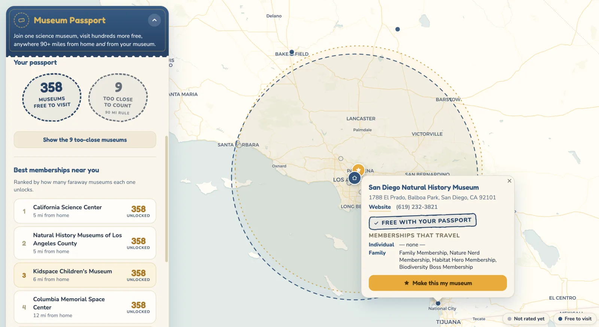

# ASTC Passport Program Map

Interactive map to help decide which ASTC museum to join

If you are a certain level of membership at a museum in the [ASTC Travel Passport Program](https://www.astc.org/membership/find-an-astc-member/passport/), you may get free admission to other museums in the ASTC Passport network, when you travel outside of your local area.

"Outside" means **greater than 90 miles** (straight-line distance) from either:
- Your home address
- The museum you are a member of

Imagine two circles with radius 90 miles. Everything around that would be eligible.



Eligible membership levels are typically but not always group/family memberships, though some individual memberships qualify. There is also a minimum membership cost requirement. See the [FAQ](https://www.astc.org/membership/find-an-astc-member/passport-faq/) for more details.

To me it makes the most sense to become a member of a museum that is:
- Somewhere my family would visit regularly
- Close to home, so the two circles are close together, to maximize the number of museums outside the ineligible area

For example, I live in Los Angeles, and will likely get a Kidspace Family membership, meaning the San Diego NHM would be eligible (111 mi away), as well as the Maui Ocean Center.

## Address search

Address search uses Google Places Autocomplete when a Maps API key is provided, which is much faster and more accurate than the free geocoders. Set it at build time:

```sh
echo 'VITE_GOOGLE_MAPS_API_KEY=your-key' > .env.local
npm run dev     # or npm run deploy
```

The key ships in the client bundle (that's how the Maps JS API works), so in the Google Cloud console restrict it to your site's HTTP referrers and to the **Places API (New)** only. Autocomplete uses [session tokens](https://developers.google.com/maps/documentation/places/web-service/session-tokens), so each completed search bills as one session rather than per keystroke.

Without a key, search falls back to the free, keyless OpenStreetMap geocoders (Photon for typeahead, Nominatim for full addresses).
